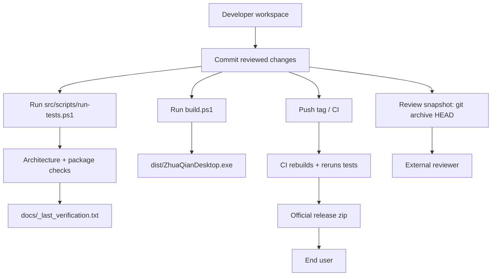

# Release Trust Pipeline

This project only shares external review snapshots and official release bundles
from committed source, never from a manually zipped working directory.

## Why This Exists

Previous reviews found a recurring trust gap: the code under review, the
verification result, and the packaged files could come from slightly different
workspace states. The fix is procedural and mechanical:

- external review snapshots come from `git archive HEAD`;
- official end-user bundles come from CI/tag build artifacts;
- local `dist/`, `outputs/`, `build/`, and retired mirrors are not release
  sources;
- verification evidence must name the exact command and date.

## Pipeline



## Commands

Create an external review snapshot from committed content:

```powershell
powershell.exe -NoProfile -ExecutionPolicy Bypass -File .\scripts\export-review-snapshot.ps1
```

The script refuses a dirty working tree by default. For an internal handoff only:

```powershell
powershell.exe -NoProfile -ExecutionPolicy Bypass -File .\scripts\export-review-snapshot.ps1 -AllowDirty
```

That archive still contains committed `HEAD` only; the filename is marked
`dirty` so nobody mistakes it for the live workspace.

## Trust Rules

1. Do not manually zip the whole workspace for review or release.
2. Do not publish locally built zips as official releases.
3. Do not treat `outputs/` or `dist/` as source.
4. Mark coordination notes as verified only after a real local or CI command ran.
5. If a statement is based on estimation, label it as unverified.

## Coding Agent Command Boundary

`CodingAgentSession` may run the repository's own build and test scripts for a
Full Review. This path uses `GuardedCommandRunRecorder`, which allows only known
project build/test commands automatically. Arbitrary commands are denied unless
a future UI approval path explicitly grants `permCommandRun`.
